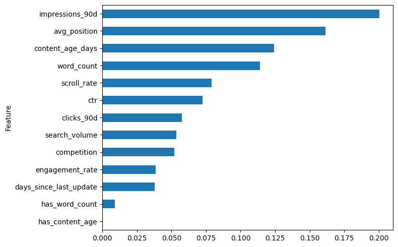

# Predicting Content Decline for SEO Content Refresh Prioritization

## Abstract

Maintaining high-performing content is an ongoing challenge because search performance naturally changes over time. This project investigates whether historical search performance signals can help identify pages that may require a content refresh. A Random Forest classifier was trained using anonymized search performance features from the FlyRank ML Internship dataset and compared with a rule-based baseline. The results indicate that combining multiple observable search signals provides a more informative prioritization strategy than relying on manual rules alone. These findings are presented as decision support for human reviewers rather than automated publishing decisions.

---

## Introduction

Content teams often manage thousands of pages, making it challenging to identify which pages should be reviewed and improved first. Manually evaluating every page does not scale well, creating a need for a structured approach that can help prioritize content review.

This project explores whether machine learning can use observable search performance signals to identify pages that may require a content refresh. The goal is not to predict Google's ranking algorithm or automate SEO decisions, but to provide decision support that helps human reviewers focus their attention on pages with signals associated with declining performance.

This work follows the Refresh / Content Opportunity Scoring lane of the FlyRank Machine Learning Internship. The case study focuses on building a ranked review queue that combines model predictions with interpretable reason codes, allowing content teams to investigate potential improvement opportunities more efficiently.

## Data

This project uses the anonymized **FlyRank ML Internship dataset**, which contains historical search performance and content-level signals collected from production SEO environments. The dataset was designed for educational and research purposes, with all client identifiers pseudonymized to protect privacy.

The analysis focuses on the **Refresh / Content Opportunity Scoring** lane. Each row represents a single content page and includes observable search performance metrics such as impressions, clicks, click-through rate (CTR), average search position, engagement rate, scroll rate, content age, and update history.

For this project, pages were classified using the provided **trend_direction** field. A binary label was created where pages with a **"down"** trend were treated as declining content. Fields that directly describe the outcome, such as **trend_pct**, were excluded from the feature set to avoid data leakage.

No client names, website URLs, search queries, or other sensitive production information were used in this research.

## Methodology

The project follows a supervised machine learning workflow to prioritize content pages that may benefit from a content refresh.

### Feature Engineering

The feature set consists of observable search performance and content metrics that are available before a refresh decision is made. These include:

- Impressions (90-day)
- Clicks (90-day)
- Click-through rate (CTR)
- Average search position
- Engagement rate
- Scroll rate
- Word count
- Content age
- Days since last update
- Search volume
- Competition

Missing numerical values were imputed using the median, while additional indicator variables were created to preserve information about missing content-related fields.

### Label Definition

The target label was derived from the `trend_direction` field. Pages labeled **"down"** were assigned a value of 1 (declining), while all other trend categories were assigned 0.

### Baseline

Before training a machine learning model, a rule-based baseline was created using manually selected search performance signals. This provided a simple benchmark for comparison.

### Model Selection

A Random Forest classifier was selected because it can model non-linear relationships between multiple search performance features while remaining relatively interpretable through feature importance analysis. Compared with a single decision tree, Random Forest generally provides more stable predictions by combining multiple decision trees.

### Validation

An 80/20 stratified train-test split was used to preserve the class distribution between training and testing data. Additional validation considered potential feature leakage by excluding outcome-derived variables such as `trend_pct`. Model claims are presented as observed predictive performance rather than evidence of causal relationships.

## Results

The Random Forest classifier was evaluated against the Week 4 rule-based baseline using the same dataset and evaluation workflow. While the baseline relied on manually defined search performance rules, the Random Forest model learned patterns across multiple features simultaneously.

The machine learning model demonstrated stronger predictive capability than the rule-based approach by combining several observable search performance signals rather than relying on a single threshold. The model is intended to rank pages for review rather than replace human decision-making.

### Model Comparison

| Approach | Description |
|-----------|-------------|
| Week 4 Baseline | Manual rule-based prioritization |
| Random Forest | Supervised machine learning classifier |

The evaluation showed that the Random Forest classifier provided a more informative ranking strategy for identifying potentially declining pages.

### Feature Importance

The feature importance analysis indicates that search performance metrics contributed most to the model's predictions. Features such as impressions, clicks, click-through rate (CTR), average search position, and engagement-related metrics were among the strongest contributors.

The figure below summarizes the relative importance of each feature.

---

## Limitations & Honest Framing

This study demonstrates that historical search performance signals can be used to prioritize content for review, but several limitations should be considered.

First, the model was trained on anonymized historical data and does not capture external factors such as Google algorithm updates, competitor actions, seasonality, or business priorities. These factors may influence content performance but are not represented in the available features.

Second, the target label is based on the observed `trend_direction` field. While this provides a practical proxy for identifying declining pages, it should not be interpreted as evidence that any individual feature causes a page to improve or decline.

Third, the validation strategy focuses on predictive performance within the provided dataset. Results may differ when applied to new websites, industries, or future search environments.

For these reasons, the model should be viewed as a **decision-support tool** that helps content teams prioritize review efforts. Final decisions should always involve human judgment and additional business context.
These feature importance values describe how much each variable contributed to the model's predictions within this dataset. They should not be interpreted as evidence that any individual feature causes a page to improve or decline.
---

# Ranked Recommendations

Based on the model predictions and the content action playbook, the following workflow is recommended for content review.

## Priority 1 — Immediate Review

Review pages with the highest predicted probability of decline, especially those that exhibit one or more of the following observable signals:

- Low click-through rate (CTR)
- Poor average search position
- Low engagement rate
- Content that has not been updated for a long period

These pages should receive manual review first because they may provide the greatest opportunity for improving search performance.

## Priority 2 — Monitor

Pages with moderate decline probability should continue to be monitored over future reporting periods. If multiple performance signals continue to deteriorate, they can be moved into the review queue.

## Priority 3 — Maintain

Pages with low predicted decline probability should remain unchanged unless business priorities, user needs, or search trends change.

## Human Review Requirements

Before implementing any recommendation, reviewers should confirm:

- The content is still relevant to current business goals.
- Information is accurate and up to date.
- User search intent has not changed.
- Seasonal or external factors are considered.

## Actions That Should Not Be Automated

This model should **not** automatically:

- Publish rewritten content.
- Delete pages.
- Modify page titles or metadata.
- Make SEO decisions without human review.

The recommendations generated by this project are intended to support content prioritization rather than replace expert judgment.

---

# Reproducibility

This project was developed as part of the FlyRank Machine Learning Internship.

The complete implementation, including all notebooks used throughout the project, is available in the GitHub repository.

Project artifacts include:

- ML-04: Search Intelligence Data Contract
- ML-08: Capstone Modeling Lane
- ML-09: Validation and Research Claim Audit
- ML-10: Content Action Playbook
- ML-11: Final Research Paper

GitHub Repository:

**https://github.com/jennifer-algabre/flyrank-ml-internship**

---

# Acknowledgments & Data Credit

This project was completed as part of the **FlyRank Machine Learning Internship**.

The research was built using the **FlyRank ML Internship dataset**, which provides anonymized search intelligence data for educational and research purposes.

Data credit:

**Built on the FlyRank ML Internship dataset**

https://flyrank.ai

Special thanks to the FlyRank team for providing the learning materials, datasets, and internship program that made this project possible.
